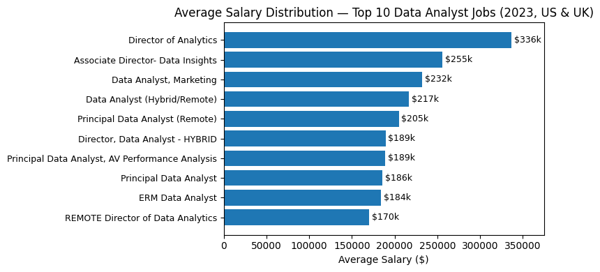

# Introduction
📊 Dive into the US & UK data job market!
Focusing on Data Analyst roles, this project explores:
- 💰 Top-paying jobs
- 🔥 Most in-demand skills
- 📈 Where high demand meets high salary in data analytics

🔎 Curious about the SQL behind the insights?
Check out the queries here: [project_sql folder](/project_sql/)
# Background
Navigating the data analyst job market can be challenging. This project was driven by a desire to better understand which roles pay the most and which skills are most in demand, helping job seekers focus their efforts on the most valuable opportunities.
The goal is to pinpoint optimal career paths by combining salary data with skill demand, making it easier to identify roles that offer both strong compensation and long-term relevance.
The dataset used in this project comes from my SQL Course and includes rich information on:
Job titles
Salaries
Locations
Required skills
This data enables a structured, SQL-driven exploration of trends in the data analytics job market.

### The questions I wanted to answer through my SQL queries were:

1. What are the top-paying data analyst jobs in the US & UK?
2. What skills are required for the top-paying data analyst jobs US & UK?
3. What are the most in-demand skills for REMOTE data analysts in the US & UK?
4. What are the top skills based on salary in the US & UK?
5. What are the most optimal skills to learn (aka skills that are both in high demand and high-paying)in the US & UK?

# Tools I Used
To conduct this in-depth analysis of the data analyst job market, I leveraged the following tools:
- **SQL** – The backbone of the analysis, used to query the database and extract meaningful insights.
- **PostgreSQL** – The database management system used to store and manage the job posting data.
- **Visual Studio Code** – The primary environment for writing, managing, and executing SQL queries.
- **Git & GitHub** – Used for version control and for sharing SQL scripts and analysis, enabling collaboration and project tracking.
# The Analysis
Each SQL query in this project was designed to investigate a specific aspect of the data analyst job market. Together, these queries provide a structured view of salaries, skill demand, and the intersection between the two.
Below is an overview of how each question was approached and what each analysis aims to uncover.

### 1. Top Paying Data Analyst Jobs

This analysis identifies the highest-paying remote Data Analyst roles in the United States and the United Kingdom.

**Approach:**
- Filter job postings to include only Data Analyst roles.
- Restrict results to remote positions.
- Exclude postings without salary information.
- Sort roles by average yearly salary in descending order.
- Return the top-paying opportunities.

**Goal:**
To highlight the most lucrative roles available to Data Analysts and provide insight into compensation trends for remote positions.

```sql
SELECT
    job_id,
    job_title,
    job_location,
    job_schedule_type,
    salary_year_avg,
    job_posted_date,
    name AS company_name
FROM
    job_postings_fact
LEFT JOIN company_dim 
    ON job_postings_fact.company_id = company_dim.company_id
WHERE
    job_title_short = 'Data Analyst'    
    AND job_country IN ('United Kingdom', 'United States')
    AND salary_year_avg IS NOT NULL
    AND job_work_from_home = TRUE   
ORDER BY
    salary_year_avg DESC,
    job_id ASC
LIMIT 10;
```
**📌 Key Findings**

Based on the results of the query, several clear trends emerge among the top-paying Data Analyst roles in 2023:

- **💰 Wide Salary Range**

The top 10 highest-paying Data Analyst roles show a substantial salary spread, ranging from approximately $170,000 to over $330,000, highlighting the strong earning potential at senior and leadership levels.

- **🏢 Diverse Employers**

High salaries are offered by a variety of companies, including Meta, AT&T, SmartAsset, and other organizations across different industries. This suggests that demand for high-level analytics talent is not limited to a single sector.

- **🧩 Job Title Variety**

While all roles fall under the Data Analyst umbrella, job titles vary significantly—from Data Analyst and Principal Data Analyst to Director of Analytics—indicating multiple career progression paths within data analytics.

- **🌍 Fully Remote Opportunities**

All top-paying roles identified are remote-friendly, reinforcing the growing availability of high-compensation remote positions in the data analytics field.



# What I Learned

# Conclusions