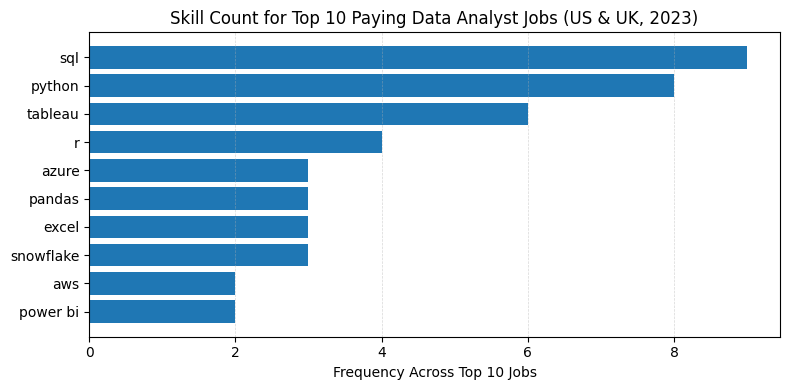

# Introduction
📊 Dive into the US & UK data job market!
Focusing on Data Analyst roles, this project explores:
- 💰 Top-paying jobs
- 🔥 Most in-demand skills
- 📈 Where high demand meets high salary in data analytics

🔎 Curious about the SQL behind the insights?
Check out the queries here: [project_sql folder](/project_sql/)
# Background
Navigating the data analyst job market can be challenging. This project was driven by a desire to better understand which roles pay the most and which skills are most in demand, helping job seekers focus their efforts on the most valuable opportunities.
The goal is to pinpoint optimal career paths by combining salary data with skill demand, making it easier to identify roles that offer both strong compensation and long-term relevance.
The dataset used in this project comes from my SQL Course and includes rich information on:
- Job titles
- Salaries
- Locations
- Required skills

This data enables a structured, SQL-driven exploration of trends in the data analytics job market.

### The questions I wanted to answer through my SQL queries were:

1. What are the top-paying data analyst jobs in the US & UK?
2. What skills are required for the top-paying data analyst jobs US & UK?
3. What are the most in-demand skills for REMOTE data analysts in the US & UK?
4. What are the top skills based on salary in the US & UK?
5. What are the most optimal skills to learn (aka skills that are both in high demand and high-paying)in the US & UK?

# Tools I Used
To conduct this in-depth analysis of the data analyst job market, I leveraged the following tools:
- **SQL** – The backbone of the analysis, used to query the database and extract meaningful insights.
- **PostgreSQL** – The database management system used to store and manage the job posting data.
- **Visual Studio Code** – The primary environment for writing, managing, and executing SQL queries.
- **Git & GitHub** – Used for version control and for sharing SQL scripts and analysis, enabling collaboration and project tracking.
# The Analysis
Each SQL query in this project was designed to investigate a specific aspect of the data analyst job market. Together, these queries provide a structured view of salaries, skill demand, and the intersection between the two.
Below is an overview of how each question was approached and what each analysis aims to uncover.

### 1. Top Paying Data Analyst Jobs

This analysis identifies the highest-paying remote Data Analyst roles in the United States and the United Kingdom.

**Approach:**
- Filter job postings to include only Data Analyst roles.
- Restrict results to remote positions.
- Exclude postings without salary information.
- Sort roles by average yearly salary in descending order.
- Return the top-paying opportunities.

**Goal:**
To highlight the most lucrative roles available to Data Analysts and provide insight into compensation trends for remote positions.

```sql
SELECT
    job_id,
    job_title,
    job_location,
    job_schedule_type,
    salary_year_avg,
    job_posted_date,
    name AS company_name
FROM
    job_postings_fact
LEFT JOIN company_dim 
    ON job_postings_fact.company_id = company_dim.company_id
WHERE
    job_title_short = 'Data Analyst'    
    AND job_country IN ('United Kingdom', 'United States')
    AND salary_year_avg IS NOT NULL
    AND job_work_from_home = TRUE   
ORDER BY
    salary_year_avg DESC,
    job_id ASC
LIMIT 10;
```
**📌 Key Findings**

Based on the results of the query, several clear trends emerge among the top-paying Data Analyst roles in 2023:

- **💰 Wide Salary Range**

The top 10 highest-paying Data Analyst roles show a substantial salary spread, ranging from approximately $170,000 to over $330,000, highlighting the strong earning potential at senior and leadership levels.

- **🏢 Diverse Employers**

High salaries are offered by a variety of companies, including Meta, AT&T, SmartAsset, and other organizations across different industries. This suggests that demand for high-level analytics talent is not limited to a single sector.

- **🧩 Job Title Variety**

While all roles fall under the Data Analyst umbrella, job titles vary significantly—from Data Analyst and Principal Data Analyst to Director of Analytics—indicating multiple career progression paths within data analytics.

- **🌍 Fully Remote Opportunities**

All top-paying roles identified are remote-friendly, reinforcing the growing availability of high-compensation remote positions in the data analytics field.


*Bar chart showing the average salary distribution for the top 10 Data Analyst roles in the US & UK (2023).*

### 2. Skills Required for Top-Paying Data Analyst Jobs

This analysis identifies the skills most commonly required for the top-paying remote Data Analyst roles in the United States and the United Kingdom.

**Approach:**

- Start from the top 10 highest-paying Data Analyst roles identified in the first analysis.
- Use a Common Table Expression (CTE) to isolate these top-paying jobs.
- Join job postings with the skills tables to retrieve all associated skills.
- Associate each skill with its corresponding job and salary.

**Goal:**

To understand which technical and analytical skills are most frequently demanded by the highest-paying Data Analyst positions, helping job seekers focus on skills aligned with top compensation.

```sql
WITH top_paying_jobs AS (
    SELECT
        job_id,
        job_title,
        salary_year_avg,
        name AS company_name
    FROM
        job_postings_fact
    LEFT JOIN company_dim 
        ON job_postings_fact.company_id = company_dim.company_id
    WHERE
        job_title_short = 'Data Analyst'
        AND job_country IN ('United Kingdom', 'United States')
        AND job_work_from_home = TRUE
        AND salary_year_avg IS NOT NULL
    ORDER BY
        salary_year_avg DESC
    LIMIT 10
)

SELECT
    top_paying_jobs.*,
    skills
FROM
    top_paying_jobs
INNER JOIN skills_job_dim 
    ON top_paying_jobs.job_id = skills_job_dim.job_id
INNER JOIN skills_dim 
    ON skills_job_dim.skill_id = skills_dim.skill_id
ORDER BY
    salary_year_avg DESC;
```

**📌 Key Findings**

Based on the skills associated with the top-paying Data Analyst roles, several clear patterns emerge:

- **🧠 Core Programming Skills**

**SQL and Python** appear consistently across the highest-paying roles, confirming their importance as foundational skills for top-compensation analytics positions.

- **📊 Data Analysis & Visualization Tools**

Tools such as **Excel, Tableau, and Power BI** are frequently required, highlighting the continued need to translate data into actionable insights—even at senior levels.

- **☁️ Cloud & Big Data Technologies**

Skills including **AWS, Azure, Databricks, Snowflake, and Hadoop** are commonly associated with higher-paying roles, reflecting demand for experience with scalable data platforms.

- **🔧 Workflow & Collaboration Tools**

Technologies like **Git, Jira, Confluence, and other Atlassian tools** appear across multiple roles, emphasizing the importance of collaboration within mature data teams.



*Horizontal bar chart showing the frequency of skills required across the top 10 highest-paying Data Analyst roles in the US & UK (2023).*

### 3. Most In-Demand Skills for Remote Data Analyst Jobs

This analysis identifies the **most in-demand skills** for **remote Data Analyst** roles in the **United States and the United Kingdom.**

**Approach:**

- Filter job postings to include only remote Data Analyst roles.
- Join job postings with the skills tables to associate each role with its required skills.
- Count the number of distinct job postings associated with each skill.
- Rank skills by demand based on how frequently they appear across postings.
- Limit results to the top 5 most in-demand skills.

**Goal:**

To determine **which skills are most frequently requested by employers**, helping job seekers focus on skills that maximize employability in remote data analyst roles.

```sql
SELECT
    skills,
    COUNT(DISTINCT skills_job_dim.job_id) AS demand_count     
FROM job_postings_fact
INNER JOIN skills_job_dim 
    ON job_postings_fact.job_id = skills_job_dim.job_id
INNER JOIN skills_dim 
    ON skills_job_dim.skill_id = skills_dim.skill_id
WHERE
    job_title_short = 'Data Analyst'                                  
    AND job_country IN ('United Kingdom', 'United States')            
    AND job_work_from_home = TRUE                                     
GROUP BY
    skills
ORDER BY
    demand_count DESC
LIMIT 5;
```
**📌 Key Findings**

- **🧠 SQL Dominates Demand**

SQL is the most in-demand skill, appearing in the highest number of remote Data Analyst job postings.

- **📊 Spreadsheet & BI Tools Remain Critical**

Excel and Tableau continue to be widely requested, emphasizing the importance of data manipulation and visualization skills.

- **🐍 Programming Skills Are Essential**

Python remains a key requirement, reflecting its central role in data analysis workflows.
- **📈 Business Intelligence Platforms Matter**

Power BI ranks among the top skills, highlighting employer demand for BI-driven insights.

| Skills   | Demand Count |
|----------|--------------|
| SQL      | 3502         |
| Excel    | 2514         |
| Tableau  | 1859         |
| Python   | 1784         |
| Power BI | 1176         |

*Table showing the demand for the top 5 skills in remote Data Analyst job postings across the US & UK (2023).*

### 4. Top Paying Skills for Data Analyst Jobs

This analysis examines **which skills are associated with the highest average salaries** for **remote Data Analyst roles** in the **US & UK.**

**Approach:**

- Filter job postings to include only **remote Data Analyst** roles with available salary data.
- Join job postings with associated skills.
- Calculate the **average salary for each skill.**
- Include only skills appearing in **at least 5 distinct job postings** to ensure relevance.
- Rank skills by average salary in descending order.
- Limit results to the top **10 highest-paying skills**.

**Goal:**

To identify the **most financially rewarding skills** for Data Analysts, helping professionals focus on skills that have the greatest impact on salary potential.

```sql
SELECT
    skills,
    ROUND(AVG(salary_year_avg),0) AS avg_salary
FROM job_postings_fact
INNER JOIN skills_job_dim 
    ON job_postings_fact.job_id = skills_job_dim.job_id
INNER JOIN skills_dim 
    ON skills_job_dim.skill_id = skills_dim.skill_id
WHERE
    job_title_short = 'Data Analyst'
    AND salary_year_avg IS NOT NULL
    AND job_country IN ('United Kingdom', 'United States')
    AND job_work_from_home = TRUE
GROUP BY
    skills
HAVING
    COUNT(DISTINCT job_postings_fact.job_id) >= 5
ORDER BY
    avg_salary DESC
LIMIT 10;
```

| Skills      | Avg Salary ($) |
|-------------|----------------|
| pandas      | 151,821        |
| numpy       | 143,513        |
| databricks | 138,785        |
| atlassian  | 131,162        |
| airflow    | 126,103        |
| crystal    | 120,100        |
| hadoop     | 119,012        |
| go          | 115,320        |
| confluence | 114,210        |
| aws         | 113,141        |

*Table showing the top 10 skills ranked by average salary for remote Data Analyst roles in the US & UK (2023).*

### 5. Most Optimal Skills for Data Analyst Jobs

This analysis identifies the **most optimal skills to learn** for Data Analyst roles—defined as skills that are both **high-paying** and **in high demand**—in the **US & UK.**

**Approach:**

- Filter job postings to include only **remote Data Analyst** roles with available salary data.
- Join job postings with associated skills.
- Calculate the **average salary for each skill**.
- Count how many distinct job postings require each skill to measure demand.
- Include only skills appearing in **at least 5 distinct job postings** to ensure relevance.
- Rank skills by **average salary**, using demand count as a secondary criterion.
- Limit results to the **top 10 most optimal skills**.

**Goal:**

To identify skills that offer the **best balance between high demand and high salary**, helping Data Analysts focus on skills that maximize both job security and earning potential.

```sql
SELECT
    skills_dim.skill_id,
    skills_dim.skills,
    COUNT(DISTINCT skills_job_dim.job_id) AS demand_count,
    ROUND(AVG(job_postings_fact.salary_year_avg), 0) AS avg_salary
FROM job_postings_fact
INNER JOIN skills_job_dim 
    ON job_postings_fact.job_id = skills_job_dim.job_id
INNER JOIN skills_dim 
    ON skills_job_dim.skill_id = skills_dim.skill_id
WHERE
    job_title_short = 'Data Analyst'
    AND salary_year_avg IS NOT NULL
    AND job_work_from_home = TRUE
    AND job_country IN ('United Kingdom', 'United States')
GROUP BY
    skills_dim.skill_id,
    skills_dim.skills
HAVING
    COUNT(DISTINCT skills_job_dim.job_id) >= 5
ORDER BY
    avg_salary DESC,
    demand_count DESC
LIMIT 10;
```

| Skill ID | Skills      | Demand Count | Avg Salary ($) |
|----------|-------------|--------------|----------------|
| 93       | pandas      | 9            | 151,821        |
| 94       | numpy       | 5            | 143,513        |
| 75       | databricks | 9            | 138,785        |
| 219      | atlassian  | 5            | 131,162        |
| 96       | airflow    | 5            | 126,103        |
| 23       | crystal    | 5            | 120,100        |
| 97       | hadoop     | 20           | 119,012        |
| 8        | go          | 27           | 115,320        |
| 234      | confluence | 11           | 114,210        |
| 76       | aws         | 26           | 113,141        |

*Table showing the most optimal skills for Data Analyst roles—those combining high demand and high average salary—in the US & UK (2023).*

# What I Learned

Through this project, I significantly strengthened my SQL skills and deepened my understanding of how data analysis is applied to real-world problems. Working through each query helped me develop a more structured and analytical approach to data.

- **🧩 Advanced SQL Querying:**  
  I improved my ability to write complex SQL queries using joins, subqueries, and Common Table Expressions (CTEs), allowing me to break down complex questions into clear, logical steps.

- **📊 Data Aggregation & Analysis:**  
  I became more confident using aggregation techniques such as `GROUP BY`, `COUNT()`, and `AVG()` to summarize large datasets and identify meaningful patterns in salaries and skill demand.

- **🔍 Analytical Thinking:**  
  This project strengthened my ability to translate business questions into SQL logic, focusing on extracting insights rather than simply retrieving data.

- **📈 Insight-Driven Decision Making:**  
  By combining salary data with skill demand, I learned how to evaluate trade-offs and uncover trends that support informed, data-driven decisions.

Overall, this project helped me connect technical SQL skills with analytical reasoning, reinforcing my progress toward becoming a Data Analyst.

# Conclusions

### Insights

From the analysis, several key insights emerged regarding the data analyst job market in the United States and the United Kingdom:

1. **Top-Paying Data Analyst Roles**  
   The highest-paying remote Data Analyst positions show a wide salary range, with compensation increasing significantly at senior and leadership levels. This highlights strong earning potential for experienced analysts.

2. **Skills Required for Top-Paying Jobs**  
   High-paying Data Analyst roles consistently require strong proficiency in **SQL**, along with complementary analytical and visualization skills. SQL stands out as a foundational requirement for accessing higher-paying opportunities.

3. **Most In-Demand Skills**  
   SQL is also the most in-demand skill across remote Data Analyst job postings, reinforcing its importance not only for salary potential but also for employability in the broader job market.

4. **Skills Associated with Higher Salaries**  
   Certain specialized and technical skills—such as data engineering tools, cloud platforms, and advanced analytics libraries—are associated with higher average salaries, indicating a premium placed on niche and technical expertise.

5. **Optimal Skills for Market Value**  
   Skills that combine **high demand and high average salary**, such as SQL and select data engineering or cloud-related tools, offer the strongest overall market value. These skills provide a balance between job security and financial reward, making them especially valuable for Data Analysts to prioritize.

Overall, this analysis demonstrates that building a strong foundation in core analytical skills while selectively developing high-value technical skills can significantly enhance both career opportunities and earning potential for Data Analysts.

### Closing Thoughts

This project reflects how I approach data analysis: starting from clear questions, using structured SQL logic, and translating raw data into actionable insights. By analyzing salary trends alongside skill demand, I focused on understanding not just *what* the market looks like, but *why* certain skills and roles carry more value.

Working through this analysis strengthened my ability to break down complex problems, apply analytical reasoning, and support conclusions with data. It also reinforced the importance of balancing technical depth with business relevance when evaluating opportunities in the job market.

Overall, this project demonstrates my growing ability to think analytically, prioritize meaningful insights, and make data-driven decisions—skills that are essential for contributing effectively as a Data Analyst.
